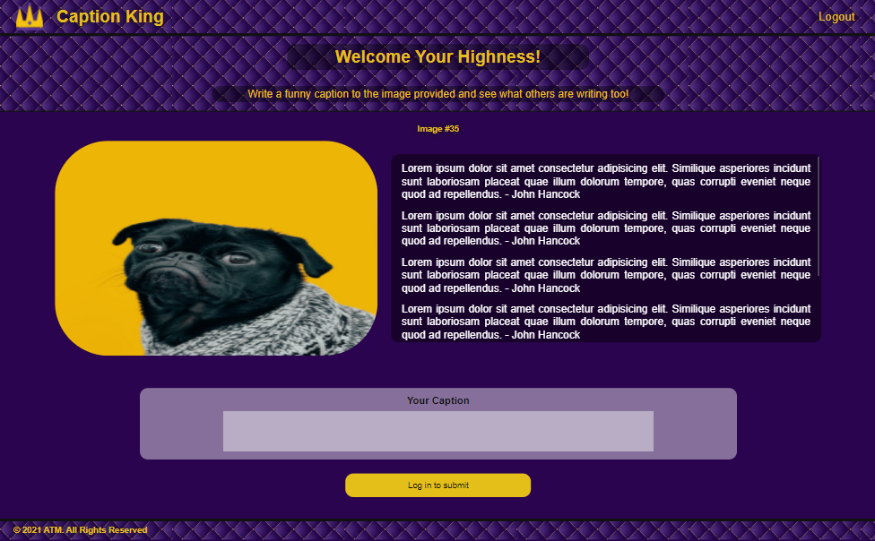
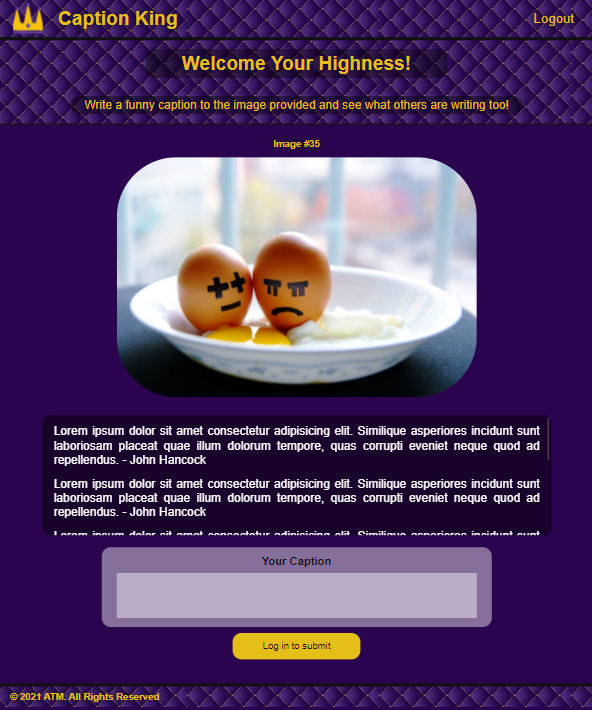
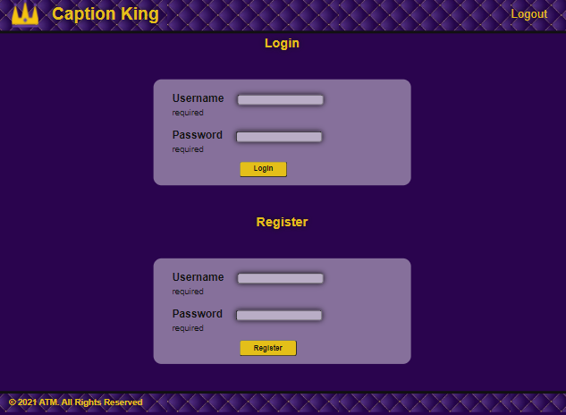

<br />
<p align="center">
  <a href="https://github.com/tbegush/PROJECT2">
    
  </a>

  <h3 align="center">Caption King</h3>

  <p align="center">
 Maybe you can become the next "Caption King"!
</p>

<!-- TABLE OF CONTENTS -->
## Table of Contents
- [Description](#description)
- [Screenshots](#screenshots)
- [Built With](#built-with)
- [Getting Started](#getting-started)
- [Installation](#installation)
- [Contributing](#contributing)
- [License](#license)
- [Contact](#contact)
- [Acknowledgements](#acknowledgements)
- [Authors](#authors)

## Description

Caption King is a website for captioning funny pictures!
## Screenshots





### Built-With

<p>
<a href="https://developer.mozilla.org/en-US/docs/Web/JavaScript" target="_blank">
<a href="https://developer.mozilla.org/en-US/docs/Web/CSS" target="_blank">
<a href="https://expressjs.com/" target="blank">
<a href="https://nodejs.org/en/docs/" target="blank">
<a href="https://dev.mysql.com/doc/" target="blank">
<a href="https://handlebarsjs.com/guide/#what-is-handlebars" target="blank">
<a href="https://www.figma.com/" target="_blank">
<a href="https://code.visualstudio.com/" target="_blank">
<a href="https://git-scm.com/" target="_blank">
<a href="https://github.com/" target="_blank">
<a href="https://www.heroku.com/about" target="blank">
</p>

<!-- GETTING STARTED -->
## Getting-Started

To get a local copy up and running follow these simple steps.

### Installation

1. Clone the repo
   ```sh
   git clone https://github.com/tbegush/PROJECT2.git
   ```
2. Install NPM packages
   ```sh
   npm install
   ```

<!-- CONTRIBUTING -->
## Contributing

Contributions are what make the open source community such an amazing place to be learn, inspire, and create. Any contributions you make are **greatly appreciated**.

1. Fork the Project
2. Create your Feature Branch (`git checkout -b feature/AmazingFeature`)
3. Commit your Changes (`git commit -m 'Add some AmazingFeature'`)
4. Push to the Branch (`git push origin feature/AmazingFeature`)
5. Open a Pull Request

<!-- LICENSE -->
## License

Distributed under the MIT License. See `LICENSE` file for more information.

## Contact

Thomas Begush - [@tbegush](https://twitter.com/tbegush) - tbegush@gmail.com - 

Project Link: [https://github.com/tbegush/PROJECT2](https://github.com/tbegush/PROJECT2)
<!-- ACKNOWLEDGEMENTS -->
## Acknowledgements

* [https://github.com/othneildrew/Best-README-Template](https://github.com/othneildrew/Best-README-Template)
* [https://source.unsplash.com/random/?funny](https://source.unsplash.com/random/?funny)
* Used Module 14 UofA Coding Bootcamp code for reference

## Authors

Alec Stewart - Thomas Begush-Cook - Marco Avila

&copy; 2021 ATM


